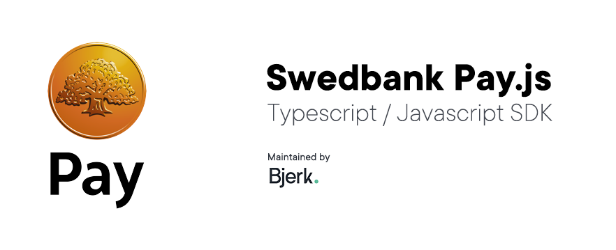

[](https://lgtm.com/projects/g/bjerkio/swedbank-pay-js/context:javascript)
[](https://codecov.io/gh/bjerkio/swedbank-pay-js)
[](https://codeclimate.com/github/bjerkio/swedbank-pay-js/maintainability)
[](https://dependabot.com)




## About

**IMPORTANT**: This SDK is at an early stage and not yet used in production.
We do not offer support for this version, but will release supported versions
in the future. Feel free to play around, but for full functionality and support,
please wait for the supported, stable release.

The Swedbank Pay SDK for Node.js simplifies integrations against
[Swedbank Pay's API Platform](https://developer.swedbankpay.com/payments/) by providing native Node.js interface towards
the REST API.

This SDK includes the following payments options:

* Credit and debit cards (Visa, Mastercard, Visa Electron, Maestro etc).

## Quickstart

```
npm install swedbank-pay
```

# Documentation
Apart from this README, you can find details and examples of using the SDK in the following places:  

- [Tutorials](tutorials/README.md)
- [SDK Documentation](docs/README.md)
- [API Documentation](https://developer.swedbankpay.com/payments/)
- [Examples](examples/)

## Contribute & Disclaimer

We love to get help 🙏 This package and repository are not connected to Swedbank Pay.
